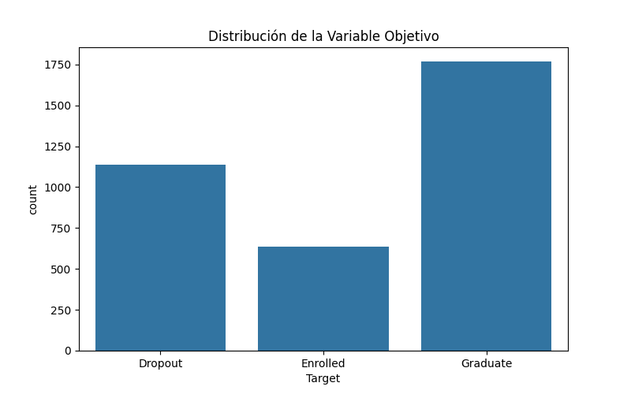
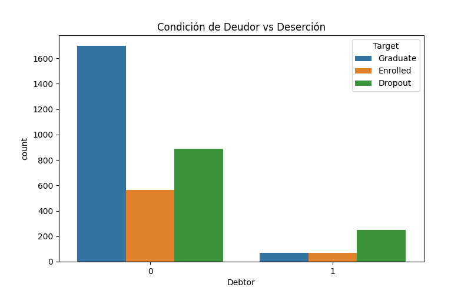
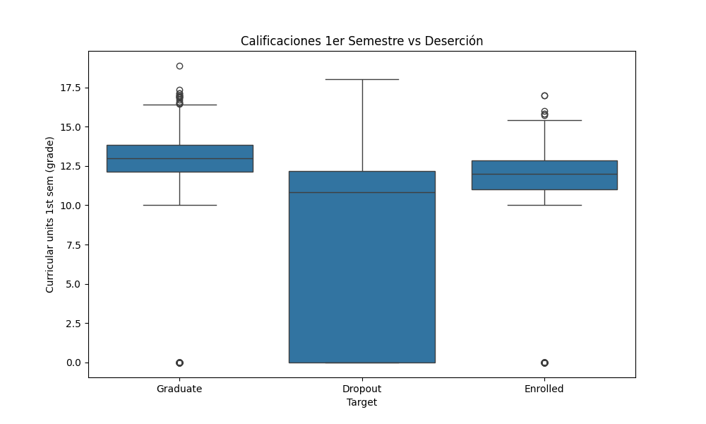
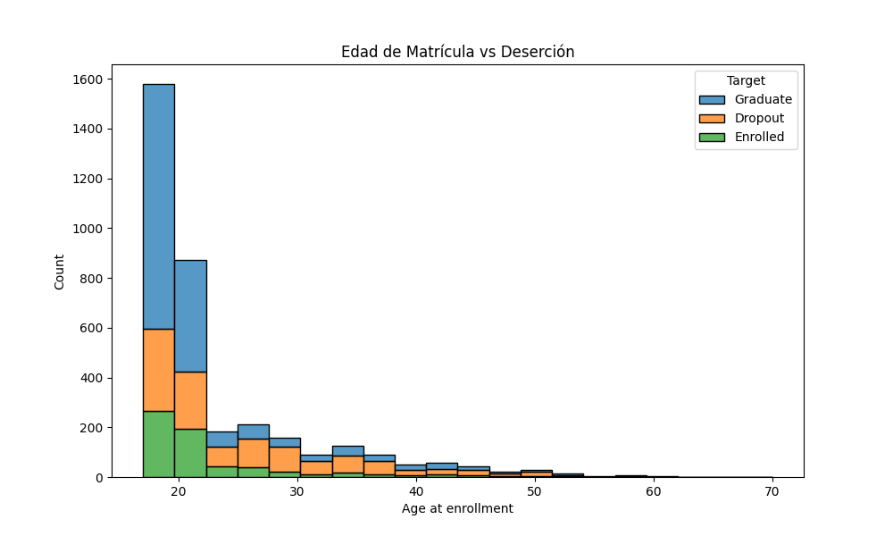

# Informe del Trabajo Parcial (TP1) - Proyecto Integrador de Data Science

Este informe ha sido desarrollado siguiendo la estructura y requisitos delineados en el curso "Data Mining Tools - CC209" para el Proyecto Integrador de Data Science, enfocado en la predicción de abandono estudiantil.

## 1. Definición del problema

El abandono universitario constituye un desafío global de gran magnitud que impacta no solo el desarrollo personal y profesional del estudiante, sino que representa una pérdida operativa, académica y financiera severa para las instituciones de educación superior. Ante este contexto, surge la necesidad apremiante de que las universidades logren identificar de forma temprana a aquellos estudiantes con un alto riesgo de deserción. Esta identificación oportuna permite a las instituciones actuar proactivamente, asignando recursos de intervención como tutorías personalizadas, programas de becas o apoyo psicológico antes de que el estudiante se retire formalmente del sistema. Para abordar esto, la unidad de análisis de nuestro proyecto se centra en el estudiante universitario de pregrado matriculado durante su primer semestre de estudios. 

El proyecto busca responder a una pregunta principal: ¿qué factores demográficos, socioeconómicos y académicos influyen en el abandono estudiantil temprano, y cómo podemos predecir de forma confiable si un estudiante desertará o completará sus estudios basándonos únicamente en la información disponible en su primer semestre? Desde la perspectiva analítica, este es un problema de aprendizaje supervisado enfocado en una clasificación binaria. Aunque el dataset original contempla tres clases, se ha redefinido para predecir si el estudiante abandona (clase positiva) o si se retiene/gradúa (clase negativa). La utilidad esperada de esta solución es reducir la tasa de deserción optimizando la asignación de presupuestos y esfuerzos de intervención. El proyecto se considerará exitoso si el modelo predictivo logra una precisión y exhaustividad que supere significativamente a una regla trivial de negocio, garantizando que al menos dos de cada tres alertas generadas correspondan a verdaderos casos de riesgo, minimizando así el desgaste institucional por falsas alarmas.

## 2. Dataset y procedencia

Para el desarrollo del modelo se ha empleado un conjunto de datos público proveniente del UCI Machine Learning Repository, titulado "Predict students' dropout and academic success", el cual fue donado por el Instituto Politécnico de Portalegre en Portugal bajo la licencia abierta Creative Commons Attribution 4.0 International (CC BY 4.0). El dataset es robusto y consta de 4,424 observaciones y 36 variables que capturan dimensiones demográficas, características socioeconómicas, indicadores macroeconómicos regionales y el desempeño académico registrado al final del primer y segundo semestre de cohortes recientes.

#### A. Dimensión Demográfica y Familiar
| Variable | Tipo de Dato | Descripción y Codificación / Rango |
| :--- | :--- | :--- |
| `Marital status` | Categórica (Nominal) | Estado civil del alumno (1: Soltero, 2: Casado, 3: Viudo, 4: Divorciado, 5: Unión de hecho, 6: Separado legalmente). |
| `Nacionality` | Categórica (Nominal) | País de origen (1: Portuguesa, 2: Alemana, 6: Española, 11: Brasileña, etc.). |
| `Displaced` | Binaria (0/1) | Estudiante desplazado de su localidad de origen (1: Sí, 0: No). |
| `Gender` | Binaria (0/1) | Género del estudiante (1: Masculino, 0: Femenino). |
| `Age at enrollment` | Numérica (Discreta) | Edad cronológica al momento de matricularse (Rango observado: 17 a 70 años). |
| `International` | Binaria (0/1) | Si es estudiante de movilidad internacional (1: Sí, 0: No). |
| `Mother's qualification` | Categórica (Nominal) | Nivel educativo máximo alcanzado por la madre (1 a 44, códigos de grado/nivel). |
| `Father's qualification` | Categórica (Nominal) | Nivel educativo máximo alcanzado por el padre (1 a 44, códigos de grado/nivel). |
| `Mother's occupation` | Categórica (Nominal) | Ocupación laboral materna según Clasificación Internacional Uniforme (ISCO). |
| `Father's occupation` | Categórica (Nominal) | Ocupación laboral paterna según Clasificación Internacional Uniforme (ISCO). |

#### B. Dimensión Socioeconómica y Soporte Institucional
| Variable | Tipo de Dato | Descripción y Codificación / Rango |
| :--- | :--- | :--- |
| `Educational special needs` | Binaria (0/1) | Presenta necesidades educativas especiales certificadas (1: Sí, 0: No). |
| `Debtor` | Binaria (0/1) | Mantiene deudas financieras con la institución educativa (1: Sí, 0: No). |
| `Tuition fees up to date` | Binaria (0/1) | Cuotas de matrícula y enseñanza al día (1: Sí, 0: No). |
| `Scholarship holder` | Binaria (0/1) | Beneficiario de beca de estudios (1: Sí, 0: No). |

#### C. Dimensión Académica de Ingreso
| Variable | Tipo de Dato | Descripción y Codificación / Rango |
| :--- | :--- | :--- |
| `Application mode` | Categórica (Nominal) | Vía/Fase de admisión (1: Fase general 1, 2: Fase general 2, cupos >23 años, etc.). |
| `Application order` | Numérica (Discreta) | Orden de preferencia de la carrera al postular (0: 1.ª opción, a 9: última opción). |
| `Course` | Categórica (Nominal) | Carrera profesional matriculada (Agronomía, Diseño, Enfermería, Gestión, etc.). |
| `Daytime/evening attendance` | Binaria (0/1) | Modalidad de turno horario (1: Diurno, 0: Nocturno/Vespertino). |
| `Previous qualification` | Categórica (Nominal) | Nivel formativo previo (Educación secundaria, educación técnica, superior, etc.). |
| `Previous qualification (grade)` | Numérica (Continua) | Calificación promedio previa obtenida (Escala portuguesa: 0 a 200). |
| `Admission grade` | Numérica (Continua) | Calificación obtenida en el examen de admisión (Escala portuguesa: 0 a 200). |

#### D. Desempeño Académico del 1.er Semestre (Predictores Activos)
| Variable | Tipo de Dato | Descripción y Codificación / Rango |
| :--- | :--- | :--- |
| `Curricular units 1st sem (credited)` | Numérica (Discreta) | Asignaturas convalidadas o acreditadas en el 1.er semestre. |
| `Curricular units 1st sem (enrolled)` | Numérica (Discreta) | Asignaturas formalmente matriculadas en el 1.er semestre. |
| `Curricular units 1st sem (evaluations)` | Numérica (Discreta) | Número total de evaluaciones rendidas en el 1.er semestre. |
| `Curricular units 1st sem (approved)` | Numérica (Discreta) | Número de asignaturas aprobadas en el 1.er semestre. |
| `Curricular units 1st sem (grade)` | Numérica (Continua) | Promedio de calificaciones en materias aprobadas (Escala 0 a 20; 0 si aprobadas=0). |
| `Curricular units 1st sem (without evaluations)` | Numérica (Discreta) | Número de asignaturas cursadas sin registro de evaluaciones. |

#### E. Indicadores Macroeconómicos Regionales
| Variable | Tipo de Dato | Descripción y Codificación / Rango |
| :--- | :--- | :--- |
| `Unemployment rate` | Numérica (Continua) | Tasa de desempleo regional durante el periodo de estudio (Rango: 6.9% a 16.2%). |
| `Inflation rate` | Numérica (Continua) | Tasa de inflación interanual nacional registrada (Rango: -0.8% a 3.7%). |
| `GDP` | Numérica (Continua) | Tasa de variación del Producto Interno Bruto nacional (Rango: -4.06% a 3.51%). |

#### F. Desempeño Académico del 2.º Semestre (Excluidas por Prevención de Data Leakage)
| Variable | Tipo de Dato | Justificación de Exclusión por Disponibilidad Temporal |
| :--- | :--- | :--- |
| `Curricular units 2nd sem (credited)` | Numérica (Discreta) | No disponible al momento de predicción (fin del 1.er semestre). |
| `Curricular units 2nd sem (enrolled)` | Numérica (Discreta) | No disponible al momento de predicción (fin del 1.er semestre). |
| `Curricular units 2nd sem (evaluations)` | Numérica (Discreta) | No disponible al momento de predicción (fin del 1.er semestre). |
| `Curricular units 2nd sem (approved)` | Numérica (Discreta) | No disponible al momento de predicción (fin del 1.er semestre). |
| `Curricular units 2nd sem (grade)` | Numérica (Continua) | No disponible al momento de predicción (fin del 1.er semestre). |
| `Curricular units 2nd sem (without evaluations)` | Numérica (Discreta) | No disponible al momento de predicción (fin del 1.er semestre). |

#### G. Variable Objetivo (Target)
| Variable | Tipo de Dato | Descripción y Codificación |
| :--- | :--- | :--- |
| `Target` *(Original)* | Categórica (Nominal) | Estado final del alumno: `Dropout`, `Enrolled` o `Graduate`. |
| `dropout` *(Binaria)* | Binaria (0/1) | Reclasificación: **1** = Abandono (`Dropout`), **0** = Retención (`Enrolled` o `Graduate`). |

La variable objetivo original, que clasificaba a los alumnos en Dropout, Enrolled o Graduate, ha sido transformada a una variable binaria donde el valor positivo representa al estudiante que abandona. Entre las variables más relevantes se encuentran el estado civil, la condición de deudor financiero, si las cuotas de enseñanza están al día, la posesión de una beca y el número de materias aprobadas durante el primer semestre. Si bien este dataset es muy completo, presenta ciertas limitaciones al estar enmarcado en un contexto regional europeo específico cuyas variables macroeconómicas podrían no ser directamente extrapolables, además de la carencia de factores cualitativos como motivación o salud mental. No obstante, se considera altamente idóneo por la riqueza y diversidad de la información recolectada tempranamente. Para garantizar la creación de un sistema de alerta temprana genuino y evitar fugas de información o data leakage, todas las columnas correspondientes al desempeño y registros del segundo semestre fueron eliminadas del flujo de trabajo de forma definitiva.

## 3. Análisis exploratorio de datos (EDA)

Durante el análisis exploratorio se evidenció que la distribución de la variable objetivo presenta un desbalance moderado. Aproximadamente el 32.1% de los estudiantes pertenecen a la clase de abandono, mientras que el 67.9% restante continúa o finaliza sus estudios. Esta proporción natural influye directamente en nuestras decisiones analíticas y en la elección de métricas de desempeño para modelos posteriores.

Al indagar en los factores socioeconómicos, descubrimos diferencias sumamente marcadas entre grupos específicos. Existe una estrecha relación entre el estado financiero del alumno frente a la universidad y su permanencia. Variables como tener las cuotas al día o ser beneficiario de una beca muestran un comportamiento protector contra la deserción. De manera notable, la tasa de abandono en aquellos estudiantes categorizados como deudores experimenta un crecimiento exponencial en contraste con aquellos que mantienen sus finanzas universitarias saneadas.

Desde el punto de vista del rendimiento académico inicial, el número de unidades curriculares aprobadas en el primer semestre se destaca como uno de los predictores más robustos. Observamos que aquellos estudiantes que no aprobaron ninguna materia, o que directamente no se presentaron a ninguna evaluación, alcanzan tasas de abandono excepcionalmente altas, superando el 68,5%.

En cuanto a las diferencias demográficas, encontramos una correlación positiva moderada relacionada con la edad al momento de matriculación. Los datos muestran que estudiantes que ingresan a la universidad con mayor edad tienden a enfrentar distintas prioridades o barreras que elevan su tasa de abandono en comparación con los jóvenes recién graduados de educación secundaria. 

Nuestra interpretación integral de estos datos sugiere que el abandono responde a una crisis simultánea en los frentes económico y académico. Los problemas económicos aparentan forzar al alumno a no disponer del tiempo necesario para sus materias, lo cual origina un bajo rendimiento temprano y desencadena el abandono definitivo de la institución.

## 4. Calidad y preparación de datos

El dataset original se presentó excepcionalmente limpio, sin valores nulos explícitos ni filas duplicadas que pudiesen comprometer la validez estadística de la muestra. Las categorías faltantes ya se encontraban debidamente codificadas. Sin embargo, al inspeccionar las reglas lógicas del dominio, detectamos una anomalía de negocio crítica relacionada con las calificaciones del primer semestre. Existe una proporción considerable de estudiantes cuyo promedio registrado es exactamente cero, valor que coincide con cero evaluaciones aprobadas. Este "cero" no representa una medida cuantitativa de un mal examen, sino un estado cualitativo de inasistencia o abandono prematuro.

Para manejar este hallazgo y evitar que los algoritmos asumieran dicho cero como parte de una pendiente numérica lineal, se introdujo una variable indicadora booleana explícita para aquellos con cero evaluaciones. Además, para los modelos de regresión, se aisló su efecto para no distorsionar las pendientes del resto de las calificaciones. Finalmente, variables numéricas que representaban en realidad categorías nominales, como el curso, la nacionalidad o el estado civil, fueron recodificadas como cadenas de texto. Esto garantizó que, durante el preprocesamiento, no se impusiera una falsa relación ordinal, previniendo sesgos en la fase de aprendizaje.

## 5. Separación de los datos

Para la partición de los datos se implementó una estrategia estricta de validación mediante un Holdout Test, dividiendo el dataset en un 80% para entrenamiento y un 20% para la prueba ciega final. Esta división no fue aleatoria simple, sino estratificada basándonos en la variable objetivo, asegurando que ambas particiones mantuvieran exactamente el 32% representativo de la clase de abandono.

La integridad de esta división se garantizó bloqueando el conjunto de prueba con una semilla aleatoria fija, lo cual hace que el proceso sea completamente reproducible y auditable. Como medida fundamental para prevenir cualquier tipo de fuga de datos, todo el proceso estadístico, desde la imputación y el escalado hasta la codificación de variables categóricas, fue ajustado de manera exclusiva sobre los datos de entrenamiento. El conjunto de prueba se mantuvo completamente aislado hasta la evaluación final. Como capa de seguridad adicional, implementamos pruebas de código automatizadas para confirmar la ausencia absoluta de características prohibidas, como las variables del segundo semestre.

## 6. Flujo reproducible de preprocesamiento

Siguiendo las mejores prácticas de la ingeniería de machine learning, la preparación de los datos nunca se ejecutó mediante modificaciones directas o destructivas sobre el dataframe en memoria. En su lugar, se diseñó una arquitectura robusta y automatizada utilizando Pipelines y ColumnTransformers de scikit-learn.

Esta estructura modular aplicó distintos tratamientos dependiendo del tipo de variable y del algoritmo de aprendizaje final. Las variables numéricas fueron estandarizadas para los modelos lineales, asegurando una correcta regularización, mientras que para los modelos basados en árboles estas pasaron sin alteraciones. Para las variables categóricas destinadas a la regresión logística, se empleó una codificación One-Hot, agrupando aquellas categorías muy infrecuentes para evitar el problema de alta dimensionalidad. En contraste, para los algoritmos ensamblados en árboles de decisión, se recurrió a un codificador ordinal, método mucho más veloz y afín a los cortes jerárquicos que realizan internamente estos modelos.

## 7. Baseline

Con el objetivo de justificar el valor de incorporar algoritmos sofisticados, se definió un baseline o punto de referencia basado en una heurística trivial del negocio. Esta regla experta simple establece que, si un estudiante ha aprobado cero unidades en su primer semestre, el sistema automáticamente lo clasifica como caso de abandono; de aprobar al menos una materia, se le clasifica como estudiante retenido o graduado. El propósito del modelo predictivo propuesto no es solo superar numéricamente esta regla rígida, sino demostrar la capacidad de descubrir perfiles de riesgo más sutiles, rescatando a aquellos estudiantes que, aun habiendo aprobado materias, terminarán abandonando por condiciones ocultas como deudas.

## 8. Modelos preliminares

El equipo evaluó distintas alternativas de modelamiento con niveles de complejidad variados, ajustándose a la naturaleza tabular mixta del problema. Por un lado, se entrenó un modelo de Regresión Logística, considerado el estándar de oro en explicabilidad y que funciona excepcionalmente bien tras preprocesar relaciones lineales dispersas. Por otro lado, se experimentó con modelos ensamblados avanzados como Random Forest y HistGradientBoosting. Estos últimos se destacan por su capacidad de encontrar interacciones no lineales de alta complejidad, como puede ser la sinergia entre la edad, el rendimiento y las finanzas. La validación y comparación de estos modelos se ejecutó rigurosamente mediante validación cruzada estratificada repetida sobre el conjunto de entrenamiento, calculando las medias y varianzas de sus métricas de desempeño.

## 9. Evaluación preliminar

Dado el desbalance moderado de las clases, la métrica principal seleccionada para evaluar y optimizar los modelos fue el área bajo la curva Precision-Recall (PR-AUC). Maximizar el PR-AUC nos garantiza encontrar un equilibrio donde se detecta a la mayoría de los desertores sin sepultar al área académica institucional en alertas falsas. Durante las rondas de validación cruzada, el modelo de Regresión Logística ofreció un balance sobresaliente, alcanzando un PR-AUC que rivalizó estrechamente con el de los modelos de ensamble más complejos, por lo que fue seleccionado priorizando la simplicidad y la parsimonia de sus coeficientes directos.

Al enfrentar los datos en la prueba ciega final, el modelo sostuvo su robustez, confirmando la ausencia de sobreajuste. En términos operativos, optimizando el umbral de decisión, logramos un nivel de exhaustividad que nos permite detectar a más del 80% de los futuros desertores. Desde la perspectiva institucional, el sistema levantaría alertas para aproximadamente un cuarenta por ciento del alumnado, y de ese grupo priorizado, dos de cada tres notificaciones representarían efectivamente un alumno en inminente riesgo de abandono. Esta precisión otorga un alto valor estratégico para la asignación de presupuestos universitarios de apoyo.

## 10. Estado del proyecto y plan hacia el TF1

Este Trabajo Parcial representa el primer gran hito de validación técnica y de negocio del proyecto. Hemos ratificado, con respaldo estadístico, que un perfil financiero endeudado sumado a un deficiente desempeño académico temprano conforman los predictores fundamentales del abandono prematuro. No obstante, reconocemos como limitación que este modelo predictivo señala síntomas y riesgos, pero no establece relaciones de causalidad directa; no garantiza que subsanar una deuda asegure automáticamente la retención, y a la vez, carecemos aún de herramientas que expliquen la alerta a nivel estrictamente individual.

De cara al Trabajo Final del curso, planificamos una evolución sistemática de la solución. En primer lugar, se incorporará optimización bayesiana para el ajuste de hiperparámetros mediante Optuna, buscando extraer hasta el último margen de rendimiento de los modelos de ensamble. Segundo, se integrará el registro sistemático de experimentos utilizando MLflow para garantizar la trazabilidad requerida. Para resolver la limitación de la explicabilidad, implementaremos la metodología SHAP, dotando al consejero académico de gráficos de contribución local que desglosen por qué un estudiante específico tiene un porcentaje de riesgo alto. Finalmente, toda esta inteligencia será encapsulada y desplegada operativamente en una aplicación web interactiva desarrollada con FastAPI y Streamlit, permitiendo a los usuarios finales simular las alertas y tomar decisiones fundamentadas en la evidencia del modelo.
